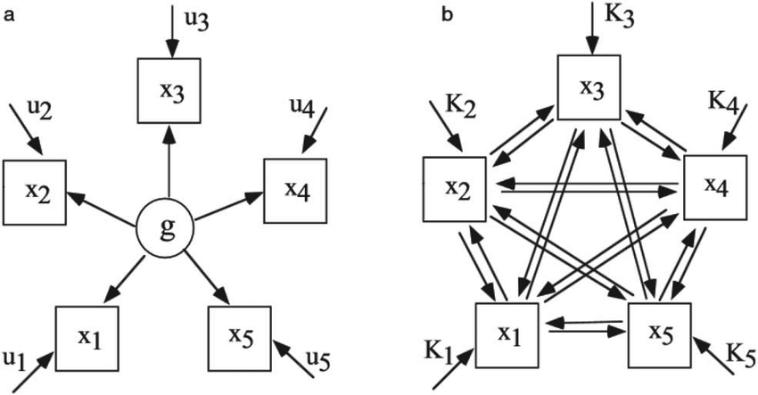

# Network Analysis

## Overview

This session will cover the basics of network analysis approach. Check the references section for more advanced topics.

## Background

Recent thinking conceptulises mental wellbeing as comprising of environmental, psychological and social factors, a challenge to static factor models. Psychologists wishing to study the dynamic interaction of many factors may wish to consider a complexity science perspective such as network analysis.

The potential utility of network analysis was noted over ten years ago in intelligence research. The frequently reported patterns of positive correlations between various cognitive tasks (e.g. verbal comprehension and working memory) are typically explained in terms of a dominant latent factor, i.e. the correlations reflect a hypothesised common factor of general intelligence (g). However, van der Maas (2006) and colleagues argued that this empirical pattern can also be accounted for by means of a network approach (see image below), wherein the patterns of positive relationships can be explained using a mutualism model, i.e. the variables have mutual, reinforcing, relationships (Hevey, 2018)



The image above from van der Maas (2006) demonstrates the difference between a latent factor and a network approach. 

## Why Use Network Analysis in Mental Health?

"Analysis of mental health data is usually based on sum-scores of symptoms or the estimation of factor models. Both types of analyses disregard direct associations among symptoms that are well-understood in clinical practice: mental disorders can be conceptualized as vicious circles of problems that are hard to escape. A novel research framework, the network perspective on psychopathology, understands mental disorders as complex networks of interacting symptoms" (Fried, 2018)

## What is a network?

A network is a set of nodes connected by a set of edges. A network (as collection of various nodes and edges) is also sometimes known as a graph.

A node (in psychological research) can represent a single item from a scale, a sub-scale, or a composite scale: the choice of node depends upon the type of data that provide the most appropriate and useful understanding of the questions to be addressed. Edges can represent different types of relationships, e.g. co-morbidity of psychological symptoms.

Several packages are used in the network analysis, including `network`, `statnet`, `igraph` and `qgraph`.

qgraph was developed in the context of psychometrics approach by Dr. Sacha Epskamp and colleagues in 2012. We will be be working with `qgraph` and `bootnet`. Please `install.packages("qgraph")` (which we will use now) and `install.packages("bootnet") (which we will use later) so we can get started. 

Now, let us load up `qgraph` - remember and save all of your code into a script.

```{r open_file, message = FALSE} 
library(qgraph)
```

## Drawing Matrices

First, we will create a blank matrix with the following code. Here, we are asking R to create a matrix with 3 rows and 3 columns.

```{r draw_empty} 
Matrix <- matrix(0,nrow=3,ncol=3)
colnames(Matrix) <- c("Node1","Node2","Node3")
```

Now, we would like to add some data. We are mapping edges between nodes. For example, in the first line of code below "3" is the weighted edge between node 1 and 2. 

```{r full} 
Matrix[1,2] <- 3
Matrix[2,1] <- 3
Matrix[2,3] <- 3
Matrix[3,2] <- 3
Matrix
```

```{r qgraph, fig.cap="Matrix Visualisation"} 
qgraph(Matrix)
```
## Task

Change the Matrix values and visualise the result using qgraph. Feel free to try negative numbers too. 

`r hide("Click to see Code")`
```{block}
Matrix[1,2] <- 3
Matrix[2,1] <- 3
Matrix[2,3] <- -3
Matrix[3,2] <- 3

qgraph(Matrix)

```
`r unhide()`
