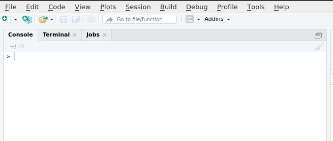
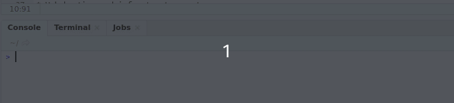

# Working With Data in R

## Overview

<span style="font-size: 22px; font-weight: bold; color: var(--purple);">Working With Data</span>

**In this session you will learn\:**

1. How to open files
2. How to write code
3. How to install packages

This is a basic introduction to R. The material is based on the data skills course for MSc students at the University of Glasgow. Find lots of useful resources here: https://gupsych.github.io/data_skills/01_intro.html 

Please take a look at these free open resources in your own time.

### Setting Working Directory

First things first, we will set the working directory. What this means is that we need to tell R where the files we need are located. Think of it just like when you have different projects, and you have seperate folders for each project e.g. research conducted in schools, research conducted in the community and so on. When working on R, it's useful to have all the data sets and files you need in one folder.

To set the working directory press session -> set working directory -> choose directory and then select the folder where the data sets we are working on are saved, and save this file in the same folder as well. In other words- make sure your data sets and scripts are all in the same folder.


### Code

RStudio generally has four panels: Current file, Console, Environment, and Viewer. You can think of the console as a place to try things out, and the file to write down ideas you want to stick around. Go to the console and type


```r
x <- 1 + 5
x
```

Notice how now the environment shows we have a Value x that is 6. We have just created a variable. In the above, we would say “the variable x is assigned to 1 + 5” or “x gets 1 + 5”

### Functions & Arguments

We have already created some code. But what does it all mean?

Functions in R execute specific tasks and normally take a number of arguments (if you’re into linguistics you might want to think as these as verbs that require a subject and an object). You can look up all the arguments that a function takes by using the help documentation by using the format `?function`. Some arguments are required, and some are optional. Optional arguments will often use a default (normally specified in the help documentation) if you do not enter any value.

As an example, let’s look at the help documentation for the function rnorm() which randomly generates a set of numbers with a normal distribution. Just like the numbers in the graph below.


Open up R Studio and in the console, type the following code:


```r
?rnorm
```

The help documentation for `rnorm()` should appear in the bottom right help panel. In the usage section, we see that `rnorm()` takes the following form:


```rnorm2
rnorm(n, mean = 0, sd = 1)
```

In the arguments section, there are explanations for each of the arguments. `n` is the number of observations we want to create, `mean` is the mean of the data points we will create and `sd` is the standard deviation of the set. In the details section it notes that if no values are entered for mean and sd it will use a default of 0 and 1 for these values. Because there is no default value for n it must be specified otherwise the code won’t run.

Now, try running the above code for 50 participants with a mean test score of 3 and a standard deviation of 1.

Remember we are asking R to create **random** numbers here, so do not worry if someone else has slightly different values.


<div class='solution'><button>I need a hint!</button>

`n` in this case would be changed to 50. 

`mean` should be changed to 3

`rnorm(50, mean = 3, sd = 1)`

now, try running the above code and see what happens. 

</div>


## Scripts

So far we have been typing into the console but that means all work is lost when re-start R. We can save our analysis code in scripts. To create a new script select the option from the File menu.




### Tidyverse


However, we do not always want to use R to create random numbers, we want to use it to analyse our own data which commonly resides in .csv or .sav files. People have developed many different libraries to help us work with such data. One of the most popular packages is tidyverse.

The Tidyverse is a collection of R packages with a common design , grammar, and data structure that makes analysis faster and easier.

The first time you want to use a package, you must first install the package. `tidyverse` can be installed as follows.




```rinstall
install.packages("tidyverse")
```

Once the package has been installed, any time you want to use the package you use the following code. If you want to open a package other than `tidyverse`, simply substitute the package name. 

### Opening SPSS Files

The `foreign` package allows easy opening of .sav files which are associated with SPSS.

You can either set a path to open up an SPSS file or run `file.choose()` and pick the file manually.

To use foreign, we need to first install the package, same as we did with tidyverse. Follow the instructions for installing tidyverse and subsitute the package name. 

<details>
<summary>Click to see solution...</summary>

```rforeign
install.packages("foreign")
```

Once you have installed packages, .sav files can be opened using (editing in your actual file name) with the following code:

`dataset = read.spss("YOURFILENAMEHERE.sav", to.data.frame=TRUE)`

While we are not using spss files during this training, it is useful to know how to do this.

## iris Task


R comes with a few built in data sets. One of which is called `iris` which is about the plant . Now that we have installed `tidyverse` let us see what it can do.

Create a new script and call the script iris. We are going to look at the top ten values of the in built data set. Once you are done, feel free to try looking at the top 3,7 and 31 values.


```r
library("tidyverse")
head(iris, 10)
```

```
##    Sepal.Length Sepal.Width Petal.Length Petal.Width Species
## 1           5.1         3.5          1.4         0.2  setosa
## 2           4.9         3.0          1.4         0.2  setosa
## 3           4.7         3.2          1.3         0.2  setosa
## 4           4.6         3.1          1.5         0.2  setosa
## 5           5.0         3.6          1.4         0.2  setosa
## 6           5.4         3.9          1.7         0.4  setosa
## 7           4.6         3.4          1.4         0.3  setosa
## 8           5.0         3.4          1.5         0.2  setosa
## 9           4.4         2.9          1.4         0.2  setosa
## 10          4.9         3.1          1.5         0.1  setosa
```

What do you think `tail(iris, 10)` will do?

## Calculate a Mean

From looking at the dataset, we can see it has information on the sepal and petal lengths and widths for different species of iris. We are interested in calculating **mean** petal width and we will use the `summarise` function to do it.

`summarise` is a useful function which works for means, medians and interquartile ranges and gives results in a single row.

You can run `?summarise` to bring up the help function for more information.

Now, try running the following codes within your iris script.


```r
iris %>% summarise(mean_petal_length = mean(Petal.Length))
```


```r
mean_iris <- iris %>% summarise(mean_petal_length = mean(Petal.Length))
```

- From the following options, what is the difference in the code? <select class='solveme' data-answer='["one is assigned to a variable"]'> <option></option> <option>one is assigned to a variable</option> <option>one actually calculates the median</option> <option>both are the same</option></select>  


<div class='solution'><button>Explain This Answer!</button>

`mean_iris <- iris %>% summarise(mean_petal_length = mean(Petal.Length))` calculates the mean and creates a new dataframe (which can be seen in the environment) while `iris %>% summarise(mean_petal_length = mean(Petal.Length))` simply calculates the mean.,

</div>
 

## Calculate a Median

A lot of data in psychology can be skewed, so sometimes the median is better (as numbers are equally likely to fall above or below it). How would you adapt the code for calculating the mean to calculate a median?

Calculate median petal width and save to your script.


<div class='solution'><button>I need a hint!</button>

`mean(Petal.Width)` is the function within the code block that calculates the mean, try changing to median(Petal.Width). mean_petal_width is a column name we made up so it might be a good idea to rename it something meaningful.

</div>
 

### Keeping Environment Clean

As you work, you will notice your environment will (quickly) fill up with lots of variables that you have assigned. 


Before beginning any new analyses it is important to clear the environment which can be done with the following code. If you run this code R will forget any libraries that you have loaded, such as `tidyverse`.


```r
rm(list = ls())
```


