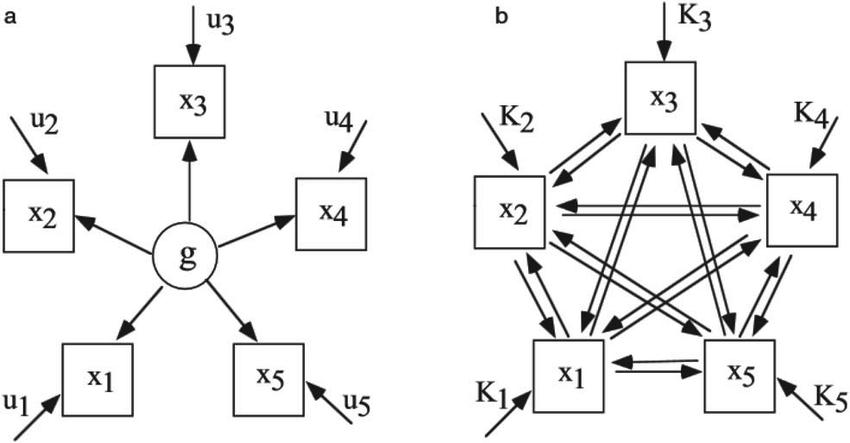

# Network Analysis

## Overview

**In this session you will learn\:**

1. Basics of Network Approach

Check the references section for more advanced topics!


## Background

Recent thinking conceptulises mental wellbeing as comprising of environmental, psychological and social factors, a challenge to static factor models. Psychologists wishing to study the dynamic interaction of many factors may wish to consider a complexity science perspective such as network analysis.


The potential utility of network analysis was noted over ten years ago in intelligence research. The frequently reported patterns of positive correlations between various cognitive tasks (e.g. verbal comprehension and working memory) are typically explained in terms of a dominant latent factor, i.e. the correlations reflect a hypothesised common factor of general intelligence (g). However, van der Maas (2006) and colleagues argued that this empirical pattern can also be accounted for by means of a network approach (see image below), wherein the patterns of positive relationships can be explained using a mutualism model, i.e. the variables have mutual, reinforcing, relationships (Hevey, 2018)



The image above from van der Maas (2006) demonstrates the difference between a latent factor and a network approach, similiar to what we have seen in the slides.

## Why Use Network Analysis in Mental Health?

"Analysis of mental health data is usually based on sum-scores of symptoms or the estimation of factor models. Both types of analyses disregard direct associations among symptoms that are well-understood in clinical practice: mental health problems can be conceptualized as vicious circles of problems that are hard to escape. A novel research framework, the network perspective on psychopathology, understands mental disorders as complex networks of interacting symptoms" (Fried, 2018)

However, mental health networks can contain more than just symptoms. [In a study looking at patients with schizophrenia](https://jamanetwork.com/journals/jamapsychiatry/fullarticle/2671414?casa_token=nGUSw-yIg1YAAAAA%3aXJz4Ehq44lBBE3iDqQhuNSGgJfafMX9lGyiDx9YxHJpVSFVOJo0gkA0NdrEGhY9T-6mvlB17) the researchers wanted to understand the extent to which variables belonging to the same construct were connected and how different constructs mutually interacted and reinforced one another. In addition to modelling symptoms, the researchers also looked at engagement with mental health services and interpersonal relationships. This is important when we want to explore what wider influences might impact upon behaviour we are interested in.

## What is a network?

A network is a set of nodes connected by a set of edges. A network (as collection of various nodes and edges) is also sometimes known as a graph.

A node (in psychological research) can represent a single item from a scale, a sub-scale, or a composite scale: the choice of node depends upon the type of data that provide the most appropriate and useful understanding of the questions to be addressed. Edges can represent different types of relationships, e.g. co-morbidity of psychological symptoms.

Several packages are used in the network analysis, including `network`, `statnet`, `igraph` and `qgraph`.

qgraph was developed in the context of psychometrics approach by Dr. Sacha Epskamp and colleagues in 2012. We will be be working with `qgraph` and `bootnet`. Please `install.packages("qgraph")` (which we will use now) and `install.packages("bootnet")` (which we will use later) so we can get started. 

Now, let us load up `qgraph` - remember and save all of your code into a script.


```r
library(qgraph)
```

## Drawing Matrices

Tasks on section 3 are based on that of [Derek De Beurs](http://www.derekdebeurs.com/about) who uses network analysis to understand suicide ideation. Check out his work.

First, we will create a blank matrix with the following code. Here, we are asking R to create a matrix with 3 rows and 3 columns.

The code `colnames(Matrix) <- c("Node1","Node2","Node3")` is simply providing column names in the order they are created.

We can see that we have created a 3x3 matrix with no data.

```r
Matrix <- matrix(0,nrow=3,ncol=3)
colnames(Matrix) <- c("Node1","Node2","Node3")
Matrix
```

```
##      Node1 Node2 Node3
## [1,]     0     0     0
## [2,]     0     0     0
## [3,]     0     0     0
```

Now, we would like to assign some data to the matrix. We are mapping edges between nodes. For example, in the first line of code below "3" is the weighted edge between node 1 and 2. 


```r
Matrix[1,2] <- 3
Matrix[2,1] <- 3
Matrix[2,3] <- 3
Matrix[3,2] <- 3
Matrix
```

```
##      Node1 Node2 Node3
## [1,]     0     3     0
## [2,]     3     0     3
## [3,]     0     3     0
```


```r
qgraph(Matrix)
```

\begin{figure}

{\centering \includegraphics[width=1\linewidth]{03-s01-lab02a_files/figure-latex/qgraph-1} 

}

\caption{Matrix Visualisation}(\#fig:qgraph)
\end{figure}
## Understanding Network plots

Change the Matrix values and visualise the result using qgraph. Feel free to try negative numbers too. 

<details>
<summary>Click to see one possible example...</summary>

```r
Matrix[1,2] <- 3
Matrix[2,1] <- 3
Matrix[2,3] <- -3
Matrix[3,2] <- 3

qgraph(Matrix)
```

\begin{figure}

{\centering \includegraphics[width=1\linewidth]{03-s01-lab02a_files/figure-latex/unnamed-chunk-2-1} 

}

\caption{One Example - Change Numbers to see what happens}(\#fig:unnamed-chunk-2)
\end{figure}

## Task

Please run the following code and look at *both* the visualisation of the nodes and the strength plot, what do you think this tells us about node 2?


```r
Matrix[1,2] <- 3
Matrix[2,1] <- 3
Matrix[2,3] <- 3
Matrix[3,2] <- 3

data_frame <- qgraph(Matrix)
```

\begin{figure}

{\centering \includegraphics[width=1\linewidth]{03-s01-lab02a_files/figure-latex/centrality-1} 

}

\caption{Centrality Plot}(\#fig:centrality1)
\end{figure}

```r
centralityPlot(data_frame)
```

```
## Note: z-scores are shown on x-axis rather than raw centrality indices.
```

\begin{figure}

{\centering \includegraphics[width=1\linewidth]{03-s01-lab02a_files/figure-latex/centrality-2} 

}

\caption{Centrality Plot}(\#fig:centrality2)
\end{figure}

