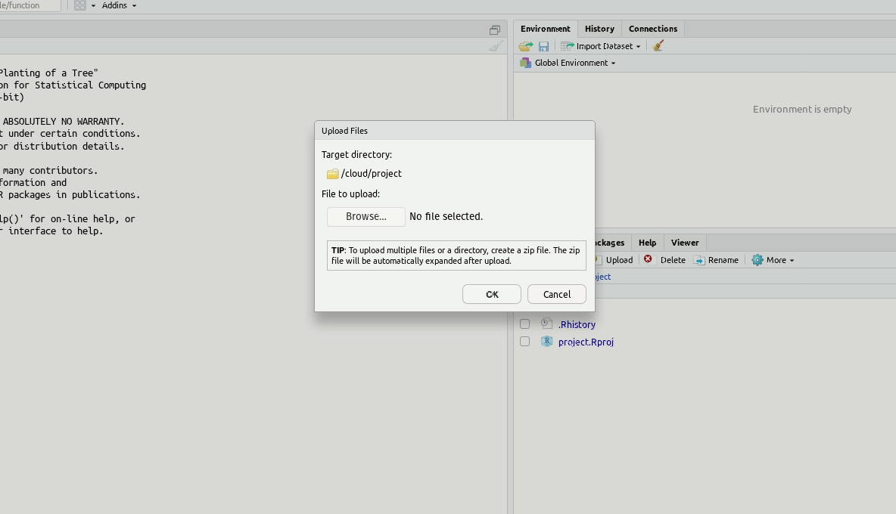

# (APPENDIX) Appendices {-} 

# RStudio Cloud

Sometimes R might not work well on our own computers. However, there is an online version of R Studio (R Studio Cloud) which can be used in a pinch. Using R Studio Cloud is a little different to R Studio, so we have made a short guide to get you up and running.

## Creating an Account

Head to [RStudio Cloud](https://rstudio.cloud/) and click "Sign Up" at the top of the page

Enter details you wish to sign in with and select "Sign up"

You'll receive an e-mail at the address you sign up with, make sure to click the link to activate your account fully.

## Accessing RStudio Cloud

Head back to [RStudio Cloud](https://rstudio.cloud/) and select "log In", where we previously chose "Sign Up"

Once logged in, you'll be taken to the "Your Workspace" page, this is where all of your RStudio Cloud projects will be accessible from 

Select "New Project" and then "New Project" again

You will see the message "Deploying Project" for a couple of minutes while it creates your Workspace

## Getting Started with RStudio Cloud

Once loaded, you'll see a page that looks almost identical to the other screenshots in the learning material

### Naming the Workspace

Let's give the project a better name!

Click on "Untitled Project" at the top of the page

This will allow you to rename to whatever you like, in this case we'll go for "Network Training"

Press the return key on your keyboard, or click on a different area on the page to complete the task

### Uploading Files

Since this is on the web, files on your computer won't be immediately accessible to RStudio Cloud, you will need to upload them yourself

Click the "Upload" button on the Files tab

An "Upload Files" element will load up where you can click "Browse" and select the file(s) you wish to make available to RStudio Cloud

Once you have selected a file and chosen "OK", you'll be taken back to the main application and you will now see the file you uploaded

You can now interact with this file as described in the rest of the learning material!
