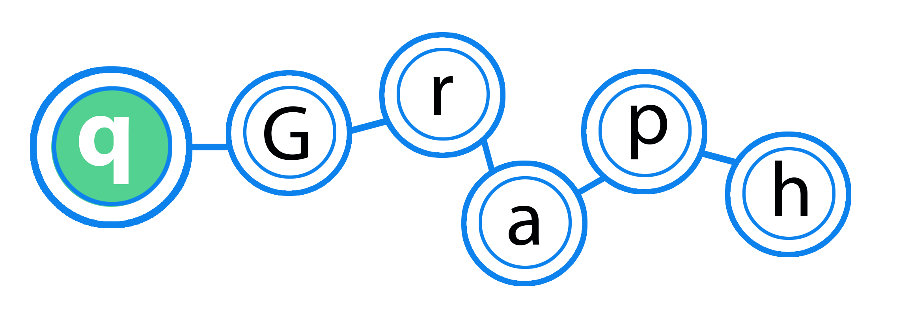

--- 
title: "Network Analysis in R"
date: "`r Sys.Date()`"
site: bookdown::bookdown_site
documentclass: book
bibliography: [book.bib, packages.bib]
biblio-style: apalike
link-citations: yes
description: network-course
---

```{r cite-packages, include = FALSE}
# automatically create a bib database for R packages
# add any packages you want to cite here
knitr::write_bib(c(
  .packages(), 'bookdown', 'tidyverse', 'broom', 'pwr', 'rtweet',
  'meme', 'gganimate', 'webex', 'ggforce', 'knitr', 'faux'
), 'packages.bib')

```

# Overview {-}



Materials for the 4 day Network Analysis course. 

This course covers skills such as installing R, opening fies, working with data using tidyverse, and making graphs. It also introduces network analysis as a statistical concept.


